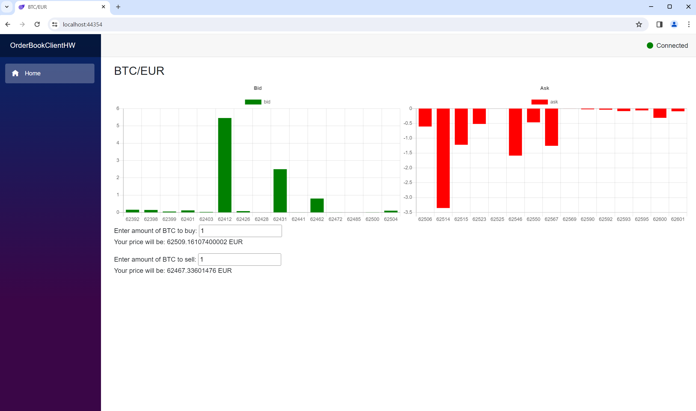

1. Setup database 
    - In directory docker run docker-compose up --build
    - Connect to database and run script from file init.sql
2. Run OrderBookApiHW using IIS Express
3. Run OrderBookClientHW using IIS Express

In case you see same screen. All done.
